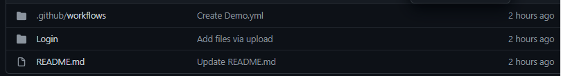

# DemoGithubActions

El objetivo de este repositorio es realizar una demostracion de Github Actions con el fin de entender cual es su idea principal de los workflows.
Para la creacion de un workflow debemos tener un proyecto alojado en github o ser colaborador del proyecto.

##Repositorio
Primero necesitamos un proyecto no importa el lenguaje de programacion
**Crear el directorio .github/workflows/

