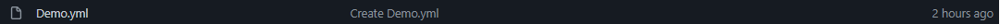
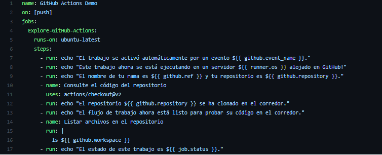
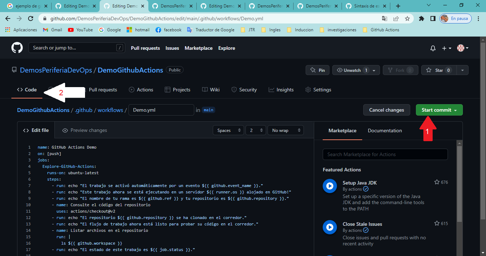
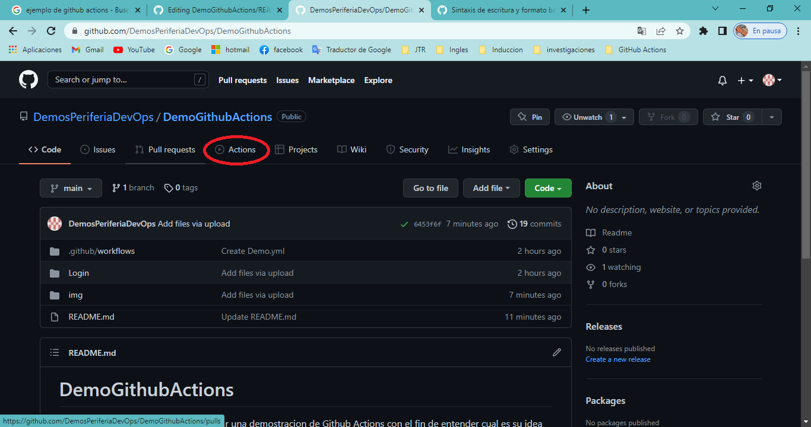
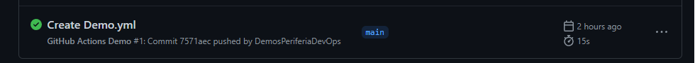
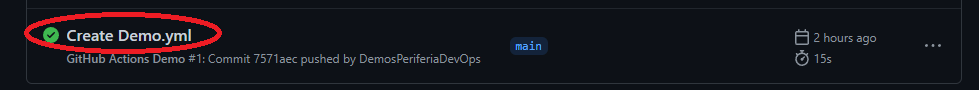
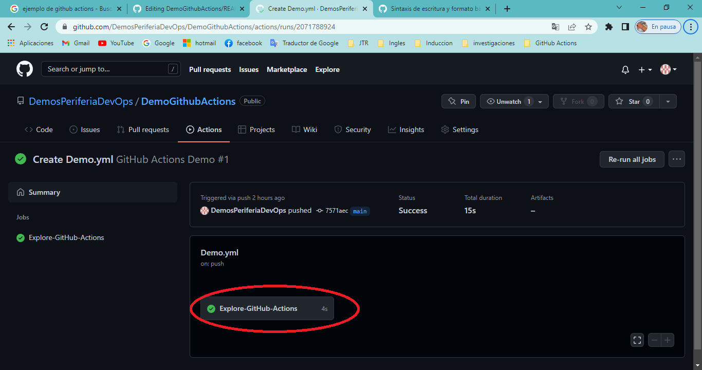

# DemoGithubActions

El objetivo de este repositorio es realizar una demostracion de Github Actions con el fin de entender cual es su idea principal de los workflows.
Para la creacion de un workflow debemos tener un proyecto alojado en github o ser colaborador del proyecto.

## Repositorio
Primero necesitamos un proyecto no importa el lenguaje de programacion
* Crear el directorio .github/workflows/

(La carpeta login es el proyecto en PHP)

* dentro del directorio .github/workflows/ crearemos un archivo .yml (En este caso se llamo demo.yml)

* dentro de ese archivo ponemos nuestro codigo para el workflow, yo pondre este codigo dentro del archivo creado

* Hacemos un commit a ese archivo creado y despues de ese paso vamos al principio de nuestro repositorio

## Mirar si se ejecuta la accion
Para mirar si se ejecuta la accion del workflow realizaremos los siguientes pasos

* en el inicio del proyecto vamos al apartado Actions

* Nos aparecera lo siguiente

Daremos clic para ver los detalles

* estaremos en este menu, daremos clic Explore-Github-Actions

* en esta parte nos apareceran los detalles, si nos aparecen con un :white_check_mark: o :ballot_box_with_check: se ejecuto correctamente la Actions 

